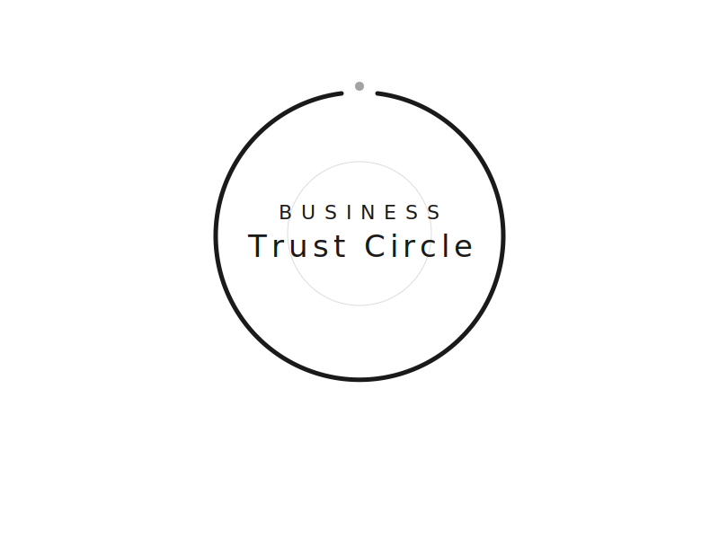

  

# Business Trust Circle

Ein vertrauensvoller, regelmäßiger Austausch unter Unternehmern und Selbstständigen – auf Augenhöhe, interdisziplinär und ohne kommerzielle Hintergedanken.

## Was ist das?

Der Business Trust Circle ist eine Mastermind-Gruppe für Unternehmer, die auf echtem Vertrauen, ehrlichem Feedback und gegenseitigem Respekt basiert. Kein Networking-Event, kein Akquise-Kanal – sondern ein geschützter Raum für den Austausch über die wirklich wichtigen Fragen des Unternehmerlebens.

**Kernprinzipien:**
- Vertraulichkeit & Vertrauen
- Augenhöhe – unabhängig von Branche oder Unternehmensgröße
- Ehrliches, konstruktives Feedback
- Keine kommerziellen Hintergedanken
- Verbindlichkeit & regelmäßige Teilnahme

## Konzept

Das vollständige Konzept mit Wertekatalog, Ablaufstruktur und Teilnehmermodell findest du in [KONZEPT.md](KONZEPT.md).

## Mitmachen

Dieses Repo ist ein lebendiges Dokument. Vorschläge, Ideen und Verbesserungen sind willkommen! Lies dir [CONTRIBUTING.md](CONTRIBUTING.md) durch, um zu erfahren, wie du beitragen kannst.

## Änderungen

Alle Änderungen am Konzept werden transparent dokumentiert: [CHANGELOG.md](CHANGELOG.md)

## Lizenz

Dieses Werk ist lizenziert unter [Creative Commons Namensnennung - Weitergabe unter gleichen Bedingungen 4.0 International (CC BY-SA 4.0)](LICENSE).

Das bedeutet: Du darfst es nutzen, anpassen und teilen – solange du die Quelle nennst und Ableitungen unter derselben Lizenz veröffentlichst.
